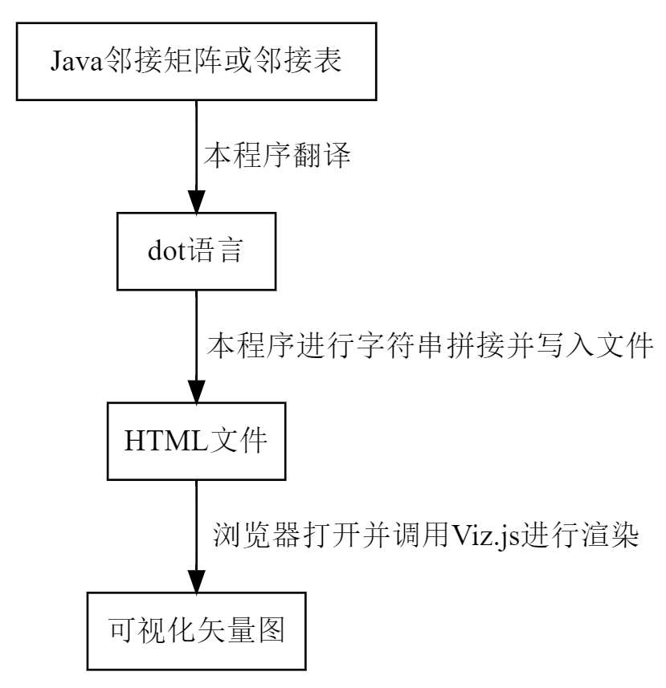

## 功能简介
本程序可以实现将Java中的邻接表和邻接矩阵转换成可视化的图
## 图片格式
程序的输出是一个HTML文件，产生的图在HTML中以矢量图的形式存在。具体的格式是HTMl中的svg元素。
## 借助的工具
* [Graphviz](http://www.graphviz.org/)： 由贝尔实验室开发的通过字符串来表示图的桌面端程序，虽然没有直接使用它，但这是本程序能够实现的基础
* [Viz.js](https://github.com/mdaines/viz.js/)：以Graphviz为基础，能够在网页上实现Graphviz的功能。本程序最主要的依赖工具。
## 实现机制
